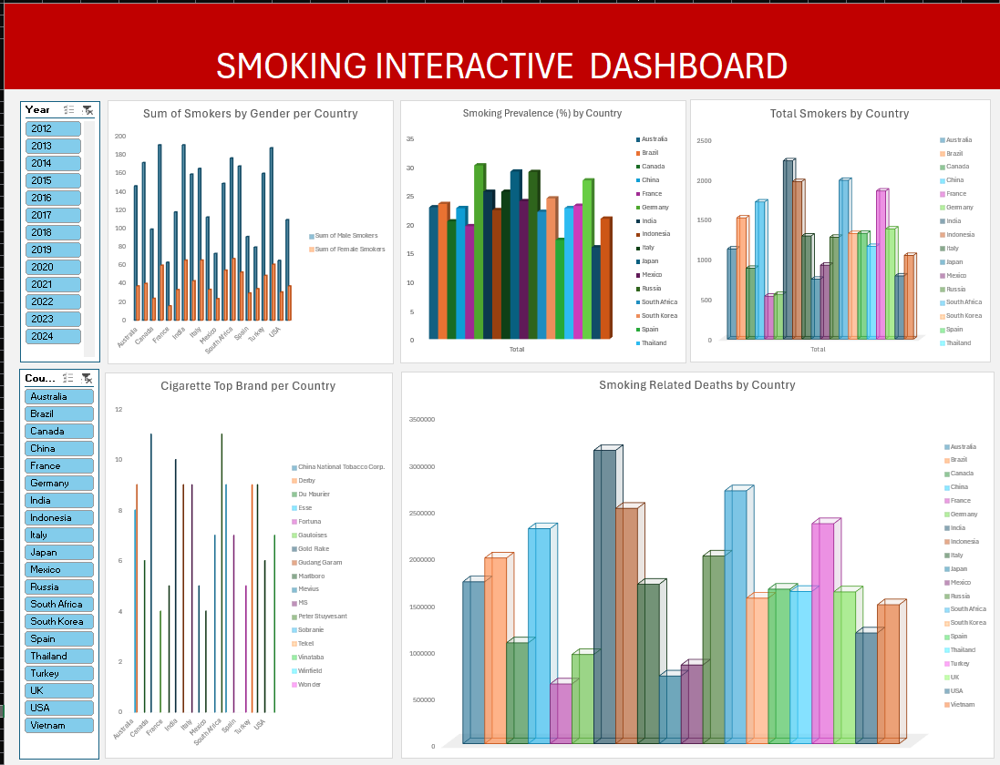

Project 1: [🚬 Smoking Interactive Dashboard](https://github.com/AyoAmao/github.io/blob/main/Smoking%20Dashboard.xlsx)
The Smoking Interactive Dashboard reveals significant gender disparities in smoking habits, with male smokers consistently outnumbering female smokers across all countries. China and India lead in total smokers driven by their large populations, while Indonesia, Russia, and Vietnam show the highest smoking prevalence percentages, indicating deeper public health challenges. The cigarette market is dominated by both local champions like China National Tobacco Corp. and global brands. Smoking-related deaths are notably high in countries with larger smoker populations, emphasizing a substantial healthcare burden. Although there are hints of declining prevalence in some developed markets over time, the overall number of smokers remains stubbornly high due to population growth and emerging markets. This underscores an urgent need for targeted, gender-sensitive, and country-specific interventions to curb tobacco use globally.

SMOKING INTERACTIVE DASHBOARD
•	It's a dynamic dashboard where you can filter by Year and Country.
Charts:
1.	Top Left: Sum of Smokers by Gender per Country
o	Two bars for each country: Male Smokers and Female Smokers.
o	Generally, males have a much higher smoking rate than females across all countries.
2.	Top Middle: Smoking Prevalence (%) by Country
o	Shows percentage of population that smokes in each country.
o	You can compare countries directly here — some countries have noticeably higher percentages than others.
3.	Top Right: Total Smokers by Country
o	Absolute numbers of smokers.
o	Some countries (like China and India) dominate in terms of total smokers — probably because of their large populations.
4.	Bottom Left: Cigarette Top Brand per Country
o	Shows which cigarette brands are most popular in each country.
o	Brands like China National Tobacco Corp, Philip Morris, and British American Tobacco appear multiple times.
5.	Bottom Right: Smoking-Related Deaths by Country
o	Number of deaths attributed to smoking.
o	Again, countries with large populations (China, India, USA) have the highest absolute smoking-related deaths.
Filters:
•	Year: You can select different years (2012–2024) to see how smoking trends have changed over time.
•	Country: You can focus on specific countries.
Overall:
•	Smoking is more prevalent among males across the world.
•	China, India, and the USA seem to have the highest total smokers and smoking-related deaths.
•	Popular brands differ per country but big players dominate (like China National Tobacco and Philip Morris).
•	Smoking prevalence (percentage of smokers) doesn't always match total smokers — a small country might have high prevalence but fewer total smokers compared to a large country.

📌 Key Insights from the Smoking Interactive Dashboard:
1.	Gender Gap in Smoking:
o	Across all countries, the number of male smokers significantly outweighs the number of female smokers.
o	This suggests that smoking habits are still heavily male-dominated globally.
2.	Highest Smoking Prevalence (% of Population):
o	Countries like Indonesia, Russia, and Vietnam show very high smoking prevalence rates, meaning a large share of their population smokes even if their total population isn't the largest.
o	Developed countries (e.g., USA, UK) have moderate smoking prevalence compared to some developing countries.
3.	Total Smokers (Absolute Numbers):
o	China and India have the largest total number of smokers, driven largely by their huge populations.
o	The USA also has a high total number of smokers despite stronger anti-smoking policies, reflecting a still large smoking community.
4.	Top Cigarette Brands by Country:
o	China National Tobacco Corporation dominates China.
o	Brands like Philip Morris, Marlboro, and British American Tobacco brands are popular across several countries.
o	This suggests strong local brand loyalty but also global brand influence in smoking markets.
5.	Smoking-Related Deaths:
o	Countries with high total smokers also report the highest smoking-related deaths (China, India, USA).
o	This highlights the serious health burden caused by smoking in both emerging and developed economies.
6.	Trend Across Years (if filtering by Year):
o	If you use the year filter, you may notice that smoking prevalence has slightly declined over recent years in some countries, but the total numbers remain high due to population growth and emerging markets.
o	Anti-smoking campaigns and regulations in developed countries (like the UK, USA) show modest success over time.

🧠 Possible Conclusions:
•	Male-focused interventions could be more effective.
•	Emerging markets like Indonesia and Vietnam may need stronger anti-smoking policies.
•	Global brands continue to dominate even in countries with growing local markets.
•	Healthcare systems need to prioritize smoking-related disease prevention in countries with high death rates.

Dashboard Overview: 

